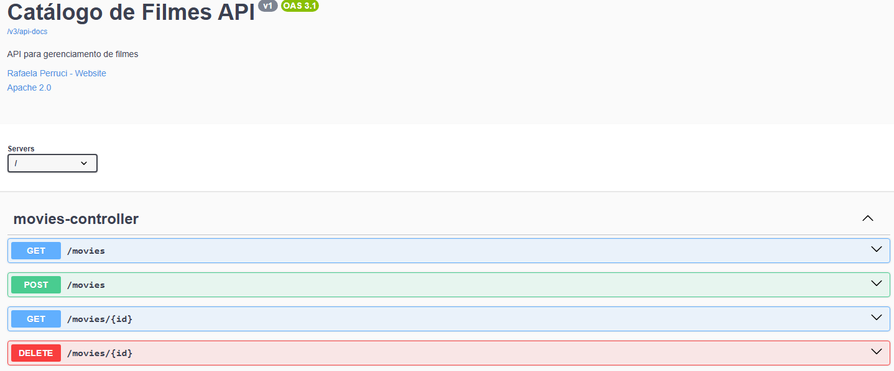

## Sobre o projeto

MovieCatalogInfo é uma API RESTful desenvolvida para facilitar o cadastro, consulta e gestão de filmes. Por meio de endpoints intuitivos, a API permite criar novos registros com informações completas como título, sinopse, data de lançamento e avaliação; buscar filmes por ID ou título, com suporte a filtros e paginação; listar todos os filmes cadastrados de forma ordenada e paginada; e excluir registros de filmes pelo ID de maneira segura.

## Funcionalidades:
➕ Cadastrar novos filmes

🔍 Consultar filmes por ID ou título

📄 Listar todos os filmes cadastrados

❌ Deletar filme por ID

🛠️ Tecnologias usadas

- Java 21

- Spring Boot

- Spring Data JPA

- H2 Database

- Springdoc OpenAPI (Swagger 3)

- Maven

## 📘 Interface da Documentação da API (Swagger)

Documentação do Swagger:

