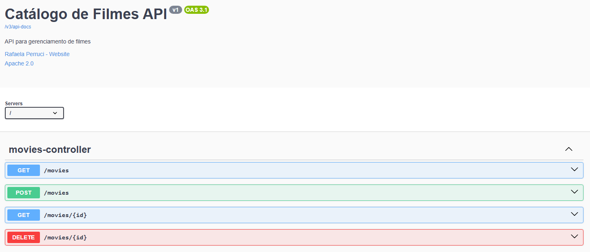

# 🎬 Api de Consulta e Cadastro de Filmes

## Funcionalidades:
➕ Cadastrar novos filmes

🔍 Consultar filmes por ID ou título

📄 Listar todos os filmes cadastrados

## 📘 Interface da Documentação da API (Swagger)

Abaixo, visualização da interface Swagger da documentação:

